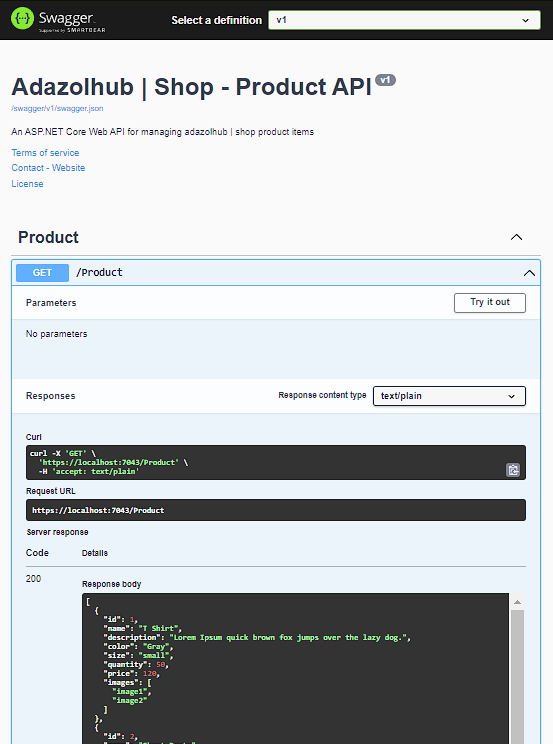
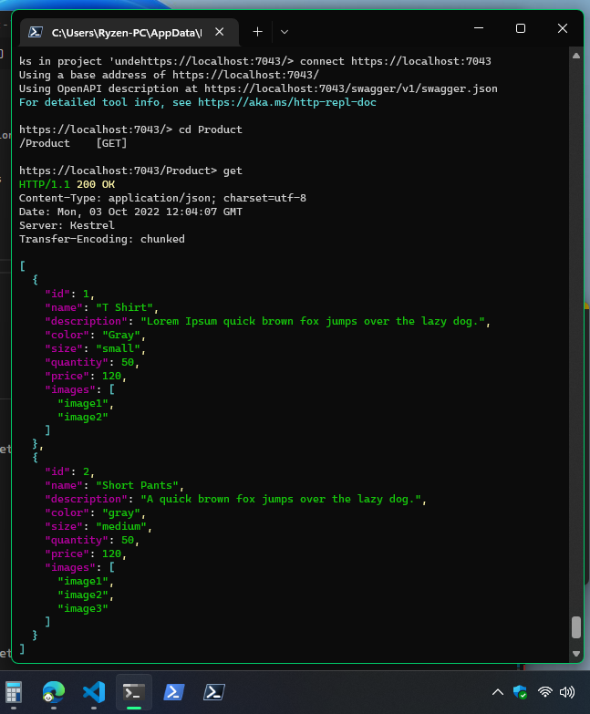

# ASP.NET + REST API + Swagger Doc UI

## Understanding REST API with ASP.NET

Adazolhub shop product api endpoints to perform CRUD operation on the backend through REST API.

Implemented Swagger UI for developer friendly test endpoints



Using terminal console to test API endpoints


---

## Setup

1. Initialize Webapi

```bash
dotnet new webapi -f net6.0
```

2. install HTTP requests tools to test ASP.NET Core web APIs on console/terminal

```bash
dotnet tool install -g Microsoft.dotnet-httprepl
```

3. Install Local Development Certificate

```bash
dotnet dev-certs https --trust
```

4. Run Webapi

```bash
dotnet run
```

5. Start test request to endpoints

```bash
# start connection
httprepl https://localhost:{PORT}

# connnect to endpoint
(Disconnected)> connect https://localhost:{PORT}

# navigate to specific endpoint
cd <Name_OF_Endpoint>

# request using "GET" method
get

```

## Author

[Daniel Lozada](https://github.com/adazol123)
